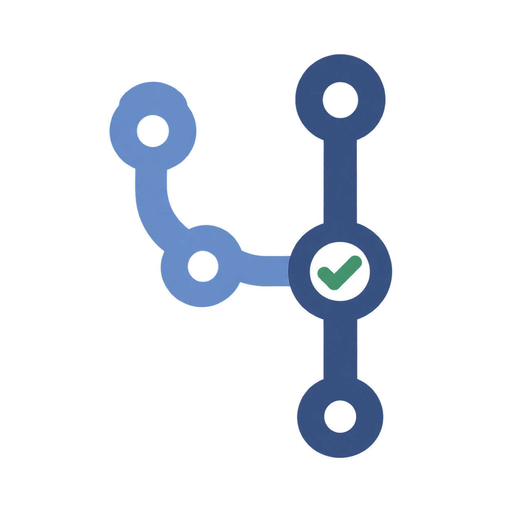

<p align="center">
  
</p>

<h1 align="center">AegisCodeAgent</h1>

<p align="center">
  <a href="README.md">English</a> | <a href="README.zh-CN.md">简体中文</a> | <a href="README.ja.md">日本語</a> | <a href="README.es.md">Español</a>
</p>

<p align="center">
  <a href="https://www.orcarouter.ai/ref/ref_7d9895701ff01fc94d85"> OrcaRouter</a> · <a href="docs/providers.md#referral-disclosure">Proveedor opcional · aviso sobre referidos</a>
</p>

Un agente de revisión de código centrado en Go que funciona dentro de los PR de GitHub. Combina análisis estático, contexto del repositorio, razonamiento del modelo y verificación independiente; publica hallazgos P0–P3 y un informe HTML con evidencia. No necesita un servidor permanente.

> **Candidato de lanzamiento v1 en desarrollo.** Se han implementado workflows reutilizables, proveedores opcionales, análisis aislado y evaluación sobre código real. Esto no significa que exista una etiqueta publicada, una evaluación de calidad con API real o un sitio de informes desplegado. [Validación y límites](docs/validation.md).

> **Migración en dos etapas:** mientras exista `examples/aegis-review-v1-migration.yml`, esta revisión está en la etapa 1 y conserva el workflow de PR antiguo. El workflow reutilizable de cuatro jobs con aislamiento descrito abajo **todavía no está activo**. La etapa 2 requiere integrar primero la implementación en el `master` confiable, eliminar ese archivo y activar v1 en el workflow real. El PR #12 mostró fallos de migración y CI; las correcciones aún requieren validación en GitHub. Sigue el [orden de migración](docs/github-action.md), sin confiar automáticamente en el Head objetivo. Activar la configuración no demuestra que el despliegue haya pasado las pruebas.

## Funcionamiento y arquitectura

Lo siguiente describe v1 después de activar y validar su workflow.

```text
PR creado / actualizado → revisor confiable y Base/Head exactos
    → Diff → análisis estático paralelo → contexto AST/tipos/llamadas/tests/intención
    → Reasoning Agent + herramientas limitadas de solo lectura
    → Verifier: Verified / Needs Review / Rejected
    → Publisher independiente: HTML, anotaciones y comentario actualizado
    → Aegis merge gate
```

Los analizadores son `go test`, `go vet`, `staticcheck` y `gosec`. Una hipótesis del modelo no se convierte directamente en un hallazgo final: se verifican identidad, líneas cambiadas, instantánea del código y evidencia diagnóstica o reglas semánticas limitadas. Lo no confirmado permanece como `Needs Review`, nunca como una revisión limpia.

Por defecto bloquean los P0/P1 respaldados por evidencia y las hipótesis P0 sin resolver. Los P2/P3 por sí solos no bloquean. La degradación de etapas opcionales se distingue de la falta de evidencia obligatoria. `require-agent: true` exige completar el razonamiento del modelo.

En la autorrevisión se compila el revisor desde el Base confiable; en otros repositorios, desde el SHA resuelto del workflow reutilizable de Aegis, no desde el Head objetivo. Los comandos que ejecutan Go del PR se aíslan en Docker sin red, con código de solo lectura y sin clave del modelo. Un Publisher en otro runner verifica los commits y vuelve a generar el informe y la política a partir de JSON. [Límites de seguridad](SECURITY.md).

## Instalación en otro repositorio

Después de validar la etapa 2, añade `.github/workflows/aegis.yml`; no copies el código fuente de Aegis al repositorio consumidor. El workflow antiguo de la etapa 1 no admite esta instalación mediante `workflow_call`.

```yaml
name: Aegis review
on:
  pull_request:
    types: [opened, synchronize, reopened, ready_for_review]
permissions:
  actions: read
  contents: read
  pull-requests: write
jobs:
  review:
    uses: Molly166/AegisCodeAgent/.github/workflows/aegis-review.yml@REPLACE_WITH_RELEASE_COMMIT_SHA
    with:
      provider: deepseek
      model: deepseek-v4-flash
      fail-on: p1
      fail-on-needs-review: p0
    secrets:
      provider-api-key: ${{ secrets.DEEPSEEK_API_KEY }}
```

Reemplaza el marcador con el **SHA completo de una revisión auditada y publicada que contenga este workflow**. No se presupone que ya exista una etiqueta `v1`. Guarda la clave en GitHub Actions Secrets.

Consulta la sección siguiente para configurar OrcaRouter y conocer el estado de la integración. Para no llamar a modelos externos, usa `provider: none` y omite secrets. Los endpoints HTTPS compatibles y sus capacidades requieren configuración explícita. [Proveedores](docs/providers.md).

Los PR de forks y Dependabot no reciben claves del modelo. Si no pueden escribir comentarios, el resultado sigue disponible en Checks y Artifacts. Configura el check real **Aegis merge gate** como obligatorio en las reglas de rama para que GitHub impida la fusión. La primera migración desde un Base antiguo puede fallar de forma cerrada y requiere revisión explícita del mantenedor. [Guía completa](docs/github-action.md).

## Proveedor opcional: OrcaRouter

Aegis incluye un adaptador opcional para acceder a modelos mediante la API compatible de OrcaRouter. Siguen disponibles la conexión directa a DeepSeek, otros proveedores configurados explícitamente y el modo de análisis determinista sin modelos.

1. Regístrate mediante el [enlace de referido](https://www.orcarouter.ai/ref/ref_7d9895701ff01fc94d85) o el [sitio oficial sin referido](https://www.orcarouter.ai/) y crea tu propia clave API.
2. Guarda `ORCAROUTER_API_KEY` en el entorno o en GitHub Actions Secrets, nunca en el código fuente ni en JSON.
3. En la CLI, selecciona `--agent-provider orcarouter`. El endpoint es `https://api.orcarouter.ai/v1`. El modelo preconfigurado `deepseek/deepseek-v4-flash` se puede cambiar; verifica su disponibilidad y capacidades antes de usarlo. [Comandos y configuración](docs/providers.md#orcarouter).

> **Estado de la integración:** el adaptador y las pruebas de contrato con respuestas simuladas están implementados; la validación de aceptación con la API real de OrcaRouter sigue pendiente. El workflow de PR activo todavía selecciona DeepSeek. Usar `provider: orcarouter` en el workflow reutilizable requiere activar y validar la etapa 2.

**Aviso sobre referidos:** según las condiciones del programa, el mantenedor puede recibir una comisión del 5% del gasto de pago elegible de los espacios de trabajo atribuidos al enlace. Su uso es voluntario y no limita la elección de proveedor. El logotipo identifica una integración opcional con un proveedor, no la aprobación para figurar en un directorio ni un respaldo. [Detalles](docs/providers.md#referral-disclosure).

## Uso local y evaluación

Requiere Go 1.24+ y Git. v1 utiliza `os.Root` para limitar la lectura al repositorio. Usa una versión de Go compatible tanto para el revisor como para el análisis. El modo local predeterminado `--sandbox host` es solo para código confiable.

```sh
go test ./...
go build -trimpath -o /tmp/aegis ./cmd/aegis
/tmp/aegis review --repo . --base origin/master --head HEAD \
  --agent-provider none --analyzers default --output /tmp/aegis-review.html
/tmp/aegis eval --corpus eval/cases --output /tmp/aegis-golden.html
/tmp/aegis eval-live --corpus eval/live --agent-provider none \
  --analyzers default --output /tmp/aegis-live.html
```

`default` ejecuta go test/go vet; `all` exige también staticcheck/gosec. La imagen de CI incluye los cuatro. El checkout debe estar limpio y coincidir con el Head solicitado. Carga configuración explícitamente con `--config`, sin guardar claves en JSON.

Hay dos evaluaciones distintas:

- **50 casos Golden de reproducción:** validan informes, correspondencias y regresiones de la política; no miden la precisión de un modelo en vivo.
- **12 casos de código real:** 8 Bug y 4 Clean, repositorios Git sintéticos ejecutados por el binario real. Conservan omisiones, falsos bloqueos, ejecuciones incompletas, latencia, uso y procedencia.

Pocos casos sintéticos y un emparejador léxico no demuestran calidad en producción. La comparación con API requiere modelo explícito, condiciones iguales y repeticiones, y consume cuota. La [guía de evaluación](eval/README.md) explica también la ablación del Verifier.

## Límites y documentación

Esta versión se centra en repositorios Go de un solo módulo. No garantiza cobertura equivalente para todos los lenguajes, pruebas semánticas universales, correcciones automáticas ni aprovisionamiento de dependencias privadas. Docker no equivale al aislamiento de una máquina virtual.

### Abrir el informe sin descargar HTML

El alojamiento público está **desactivado por defecto**; disponer del código no demuestra que el sitio esté desplegado. Para habilitar la publicación automática, integra el publicador en la rama predeterminada, selecciona **GitHub Actions** como Source de Pages y añade la variable de repositorio `AEGIS_PUBLIC_REPORTS=true`. Si configuras revisores obligatorios en el entorno `github-pages`, cada despliegue seguirá esperando su aprobación. El publicador no activa ni sustituye el workflow de Review y no exige activar antes v1.

Los workflows productores de informes, tanto antiguos como v1, deben coincidir con un SHA256 fijo y auditado; v1 también requiere un publication manifest validado. El alojamiento público solo admite workflows de PR directos, no cadenas reusable o anidadas sin aprobar. [Fuentes compatibles y configuración](docs/report-hosting.md).

Tras finalizar la revisión y desplegar correctamente, el mismo comentario del bot incorpora un enlace destacado al informe web. Cada informe tiene su propia ruta `reports/pr-<number>/<full-head-sha>/<run-id>-<attempt>/index.html`; el JSON validado se añade a la rama `aegis-report-history` y cada despliegue regenera todo el historial. Los límites son 200 registros, 64 MiB en total y 17 MiB por registro; superarlos provoca un fallo, no el borrado automático del historial. Los fallos de publicación conservan los Artifacts/Checks y comentarios existentes y no cambian el resultado de la política de fusión.

**Solo para repositorios públicos.** Se publican código, detalles de vulnerabilidades y JSON archivado, usando todo el sitio Pages del repositorio. No lo actives sobre un sitio de documentación existente sin otro plan de despliegue. Desactivar la variable no retira los datos ya publicados. También puedes autorizar una publicación manual mediante `confirm-public` sin habilitar la automatización. Utiliza la URL HTTPS devuelta después de un despliegue correcto. [Configuración y seguridad](docs/report-hosting.md).

- [Informes HTTPS](docs/report-hosting.md): historial automático tras habilitarlo explícitamente y recuperación manual; Artifact sigue siendo la opción predeterminada. Nunca publiques código confidencial.
- [Paquetes de lanzamiento](docs/github-action.md): seis combinaciones OS/arquitectura y SHA256. Construir paquetes no publica etiquetas ni Releases automáticamente.
- [Contribuir](CONTRIBUTING.md), [seguridad](SECURITY.md) y [validación](docs/validation.md).

[Licencia MIT](LICENSE).
